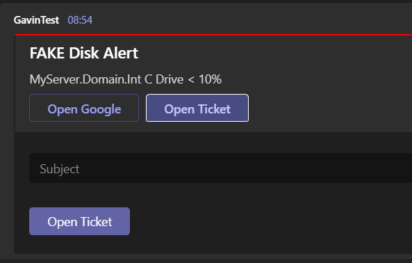

# AlertMessenger
AlertMessenger is a library that provides a clean generic way to send well formatted alert messages to multiple destinations (Think Teams, Slack...). Where the destination supports it you can also make use of actions on the sent Message Cards.


```c#
var card = CardBuilder
    .Create("FAKE Disk Alert", "MyServer.Domain.Int C Drive < 10%")
        .AddHighlight(Color.Red)
        .AddImage("https://myDomain.com/Error.jpg")
        .AddLinkAction("Open Google","http://google.com")
        .AddPostAction("Open Ticket", "https://jira.com/createTicket")
            .AddInput("Text", "Subject")    
            .BuildPostAction()
        .Build();
var teamsSender = new TeamsAlerter("https://TeamsChannelUrl");
await teamsSender.SendAsync(card);
```

